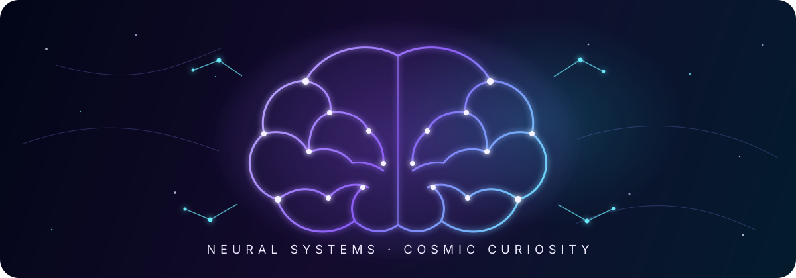

# Hi, I'm Misbahul Muttaqin 👋

### AI-Driven Full-Stack Developer · Intelligent Systems Builder · Neuroscience Explorer

  
  
  
  

> **“Build systems that think, not just compute.”**

---

## 🧠 Neural Profile

I'm **Taqin**, an AI-driven full-stack developer from **Surabaya, Indonesia**, currently studying **Information Systems at Universitas Airlangga**.

I build digital systems at the intersection of **software engineering, artificial intelligence, product design, and human cognition**. For me, code is more than implementation—it is a way to explore how information, behavior, and intelligence can be shaped into useful systems.

With **2+ years of development experience**, I have worked on competition platforms, learning management systems, event and ticketing products, company profiles, automation tools, and AI experiments. My focus is turning complex ideas into reliable products with thoughtful architecture and clean user experiences.

<table>
  <tr>
    <td width="50%" valign="top">
      <h3>⚡ Current Signal</h3>
      <ul>
        <li>Building <a href="https://www.bmec2026.com"><strong>BMEC 2026</strong></a></li>
        <li>Developing intelligent and agentic systems</li>
        <li>Exploring mobile development and deep learning</li>
        <li>Writing technical and research notes</li>
      </ul>
    </td>
    <td width="50%" valign="top">
      <h3>🌌 Core Curiosity</h3>
      <ul>
        <li>Artificial intelligence integration</li>
        <li>System and software architecture</li>
        <li>Developer tooling and automation</li>
        <li>Neuroscience and cognitive systems</li>
      </ul>
    </td>
  </tr>
</table>

- 💬 **Ask me about:** React, Next.js, Vue.js, Svelte, Go, Express.js, AI systems, and product architecture
- 🚀 **Status:** Open to remote opportunities, collaborations, and meaningful technical projects
- 📄 **Resume:** [View my resume](https://misbahul-muttaqin.vercel.app/resume.pdf)

---

## 🌌 Neural Constellation

| Signal | Exploration |
|---|---|
| 🧠 **Neuroscience + AI** | Connecting ideas from biological cognition with artificial intelligence systems |
| 🤖 **AI Systems** | Building applications that reason, retrieve knowledge, automate workflows, and assist humans |
| 🕸️ **Cognitive Architecture** | Exploring memory, planning, tools, agents, and adaptive system behavior |
| 🏗️ **Software Architecture** | Designing maintainable full-stack systems with clear domain boundaries |
| ⚡ **Rapid Experiments** | Turning hypotheses into prototypes, benchmarks, and working product features |
| 📚 **Deep Exploration** | Learning through papers, technical writing, open-source code, and implementation |

---

## 🛰️ Technology Orbit

### Interface Layer

### System Core

### Data Memory

### Engineering Tools

---

## 🚀 Featured Systems

| Project | Technology | System Purpose |
|---|---|---|
| 🏆 [**BMEC 2026**](https://www.bmec2026.com) | TanStack Start · Prisma · NeonDB | Official competition platform for Universitas Airlangga's Biomedical Engineering Competition |
| 🎤 [**TEDx Universitas Airlangga**](https://tedxuniversitasairlangga.com) | Next.js · Midtrans | Event and ticketing platform with payment integration |
| 📚 [**Revolusi Edukasi LMS**](https://www.revolusi-edukasi.com) | Vue.js · Go · REST API | Learning management and UTBK tryout platform |
| 🛒 [**Compontae**](https://compontae-web.vercel.app) | Next.js · Prisma · MongoDB | E-commerce, company profile, CMS, and publishing system |
| 📸 [**Titik Moment**](https://titik-moment.vercel.app) | Next.js | Digital product developed for a P2MW competition project |

---

## 🪐 Project Universe

<strong>🌐 Web Applications</strong>

 

- [**BMEC 2026**](https://github.com/misbahul45/bmec2026) — Official BMEC platform ⭐3
- [**Compontae Web**](https://github.com/misbahul45/compontae-web) — E-commerce and company profile ⭐1
- [**Next Portfolio**](https://github.com/misbahul45/next-portofolio) — Personal portfolio site ⭐1
- [**Nur-Verser**](https://github.com/misbahul45/nur-verser) — Web application ⭐2
- [**Donation Web App**](https://github.com/misbahul45/donation-web-app) — Donation platform ⭐1
- [**BeLearning**](https://github.com/misbahul45/BeLearning) — Learning platform ⭐1
- [**Substack Clone API**](https://github.com/misbahul45/substack-clone-api) — Newsletter platform API ⭐1
- [**Next Blog App**](https://github.com/misbahul45/next-blog-app) — Blogging platform ⭐1
- [**Astro Blog**](https://github.com/misbahul45/astro-blog) — Blog built with Astro ⭐2
- [**SocialWeb**](https://github.com/misbahul45/socialWeb) — Social media platform ⭐2
- [**Quiz App**](https://github.com/misbahul45/quiz-app) — Interactive quiz application ⭐1
- [**Modern UI**](https://github.com/misbahul45/moderen-ui-1) — Modern UI components ⭐1
- [**E-Commerce Next.js**](https://github.com/misbahul45/Ecoomerce-nextJs) — E-commerce platform ⭐1
- [**Bookstore API**](https://github.com/misbahul45/bookstore-api) — Bookstore backend API ⭐1

<strong>📱 Mobile Applications</strong>

 

- [**Greenly**](https://github.com/misbahul45/Greenly) — Flutter application ⭐4
- [**Pmob-Teo**](https://github.com/misbahul45/pmob-teo) — Mobile application ⭐1

<strong>🤖 AI & Machine Learning</strong>

 

- [**Xninetzy Assistant**](https://github.com/misbahul45/xninetzy_asistent) — AI personal assistant ⭐1
- [**Xninetzy**](https://github.com/misbahul45/xninetzy) — Intelligent personal system ⭐1
- [**Machine Learning**](https://github.com/misbahul45/machine-learning) — ML experiments and notebooks ⭐4
- [**Scikit-Learn**](https://github.com/misbahul45/scikit-learn) — Machine learning experiments ⭐1
- [**AI Engineer Toolkit**](https://github.com/misbahul45/ai-engineer-toolkit) — Resources for AI development

<strong>🔧 Backend & API</strong>

 

- [**Task API**](https://github.com/misbahul45/task_api) — Task management API ⭐1
- [**Microservice**](https://github.com/misbahul45/microservice) — Microservices architecture ⭐1
- [**Bookstore API**](https://github.com/misbahul45/bookstore-api) — RESTful API ⭐1

<strong>🎓 Learning & Experiments</strong>

 

- [**EduLearn**](https://github.com/misbahul45/eduLearn) — Educational platform ⭐2
- [**SE Task**](https://github.com/misbahul45/se_task) — Software engineering tasks ⭐5
- [**BE Task**](https://github.com/misbahul45/be_task) — Backend engineering tasks ⭐2
- [**Task App**](https://github.com/misbahul45/task_app) — Task management in C++ ⭐1
- [**Note App**](https://github.com/misbahul45/note_app) — Note-taking application ⭐1
- [**MemoGrow**](https://github.com/misbahul45/memoGrow) — Vue.js application ⭐1
- [**Aksamedia Task**](https://github.com/misbahul45/aksamedia-task) — Frontend task ⭐1
- [**Courses Java Console**](https://github.com/misbahul45/courses-java-console) — Java learning ⭐1
- [**Java Programming**](https://github.com/misbahul45/Java-programing) — Java fundamentals ⭐1
- [**Interview Code**](https://github.com/misbahul45/interview-code) — Coding interview preparation

<strong>🛠️ Tools & Utilities</strong>

 

- [**Nongki**](https://github.com/misbahul45/Nongki) — Social platform built with Svelte ⭐3
- [**SLAra**](https://github.com/misbahul45/SLAra) — TypeScript utility ⭐1
- [**Priceyless**](https://github.com/misbahul45/Priceyless) — Price comparison tool ⭐1
- [**Cervana**](https://github.com/misbahul45/cervana) — Web application ⭐1
- [**BeSafe**](https://github.com/misbahul45/BeSafe) — Safety platform ⭐1
- [**SupplyMinds**](https://github.com/misbahul45/supplyMinds) — Supply chain management ⭐3
- [**SynkUp**](https://github.com/misbahul45/SynkUp) — Collaboration tool ⭐3
- [**X90 Portfolio**](https://github.com/misbahul45/x90-portfolio) — Portfolio template ⭐1
- [**Greenly Doc**](https://github.com/misbahul45/greenly_doc) — Documentation site ⭐3
- [**Scrapio**](https://github.com/misbahul45/Scrapio) — Web scraper ⭐1
- [**TodoistLite**](https://github.com/misbahul45/TodoistLite) — Task manager ⭐3

---

## 📡 Neural Activity

  
  

  

  

---

## ✨ Contribution Constellation

  

---

## 📬 Open a Communication Channel

| Channel | Coordinate |
|---|---|
| 🌐 **Portfolio** | [misbahul-muttaqin.vercel.app](https://misbahul-muttaqin.vercel.app) |
| 💼 **LinkedIn** | [linkedin.com/in/misbahulmuttaqin](https://linkedin.com/in/misbahulmuttaqin) |
| 📧 **Email** | [misbahulmuttaqin395@gmail.com](mailto:misbahulmuttaqin395@gmail.com) |
| 📷 **Instagram** | [@xninetcy234](https://instagram.com/xninetcy234) |
| 🐱 **GitHub** | [@misbahul45](https://github.com/misbahul45) |

 

### Interested in intelligent systems, AI-powered products, or research collaboration?

**Let's turn curiosity into systems that can learn, reason, and create impact.**

